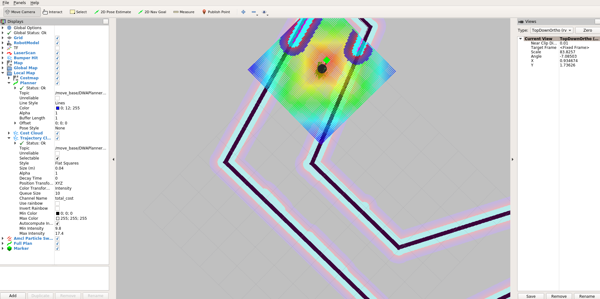
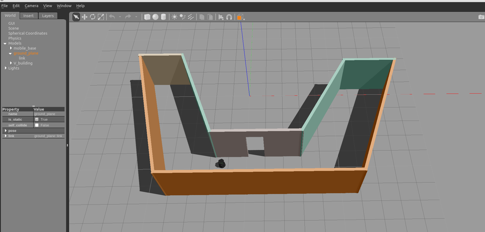

# Udacity Home Service Robot Project



This is the udacity robotic nanodegree project that aims a robot than can autonomously map an environment and navigate to pick up and drop off virtual objects. The main objectives of projects are:

* Design robot's environment with the Building Editor in Gazebo. In this project, V shape model is used.


* Operate the robot and manually test SLAM.
* Use the ROS navigation stack and manually command the robot using the 2D Nav Goal arrow in rviz to move to 2 different desired positions and orientations.
* Write a **pick_objects** node that commands the robot to move to the desired pickup and drop off zones. This objective done by using rectangular marker
* Write an **add_markers** node that subscribes to the robot odometry and publishes pick-up and drop-off markers to rviz.
* Modify **pick_objects** node and **add_markers** node to establish communication between them, to complete desired home service robot implementation

#### You will be using the following ROS packages:

* **slam_gmapping**: With the *gmapping_demo.launch* file, you can easily perform SLAM and build a map of the environment with a robot equipped with laser range finder sensors or RGB-D cameras.

* **turtlebot_teleop:** With the *keyboard_teleop.launch* file, you can manually control a robot using keyboard commands.

* **turtlebot_rviz_launchers:** With the *view_navigation.launch* file, you can load a preconfigured rviz workspace. You’ll save a lot of time by launching this file, because it will automatically load the robot model, trajectories, and map for you. You can also load rviz config file in `./rvizConfig/home_service.rviz`.

* **turtlebot_gazebo:** With the *turtlebot_world.launch* you can deploy a turtlebot in a gazebo environment by linking the world file to it.

* Used ROS packages and the process of obtaining them is detailed below:
	* [gmapping](http://wiki.ros.org/gmapping)
	* [turtlebot_teleop](http://wiki.ros.org/turtlebot_teleop)
	* [turtlebot_rviz_launchers](http://wiki.ros.org/turtlebot_rviz_launchers)
	* [turtlebot_gazebo](http://wiki.ros.org/turtlebot_gazebo)

## Project Setup
* **Note:** Project developed Ros with **kinetic** version.

Update system first:
`sudo apt-get update`

Install the ROS navigation stack:
`sudo apt-get install ros-kinetic-navigation`

Create catkin workspace:
```sh
$ mkdir -p ~/catkin_ws/src
$ cd ~/catkin_ws/src
$ catkin_init_workspace
$ cd ~/catkin_ws
$ catkin_make
```
Clone the following repositories to catkin_ws/src:
```sh
$ cd ~/catkin_ws/src
$ git clone https://github.com/ros-perception/slam_gmapping.git
$ git clone https://github.com/turtlebot/turtlebot.git
$ git clone https://github.com/turtlebot/turtlebot_interactions.git
$ git clone https://github.com/turtlebot/turtlebot_simulator.git
```
Install package dependencies with `rosdep install [package-name]`

Copy content of this repository to catkin_ws/src

Catkin workspace should look something like this:
```
catkin_ws/src
    ├── slam_gmapping                  # gmapping_demo.launch file                   
    │   ├── gmapping
    │   ├── ...
    ├── turtlebot                      # keyboard_teleop.launch file
    │   ├── turtlebot_teleop
    │   ├── ...
    ├── turtlebot_interactions         # view_navigation.launch file      
    │   ├── turtlebot_rviz_launchers
    │   ├── ...
    ├── turtlebot_simulator            # turtlebot_world.launch file 
    │   ├── turtlebot_gazebo
    │   ├── ...
    ├── map                          # world files
    │   ├── ...
    ├── scripts                   # shell scripts files
    │   ├── ...
    ├──rvizConfig                      # rviz configuration files
    │   ├── ...
    ├──pick_objects                    # pick_objects C++ node
    │   ├── src/pick_objects.cpp
    │   ├── ...
    ├──add_markers                     # add_marker C++ node
    │   ├── src/add_markers.cpp
    │   ├── ...
    └──
```


Source and build the project:
```sh
$ cd ~/catkin_ws
$ source devel/setup.bash
$ catkin_make
```
Run `./home_service.sh` in `scripts` directory to deploy the home service robot.

You can also test nodes independently by using following scripts:

    ├── scripts
    │   ├── test_slam.sh
    |   ├── test_navigation.sh
    │   ├── pick_objects.sh
    │   ├── add_marker.sh
    │   ├── map_creator.sh

